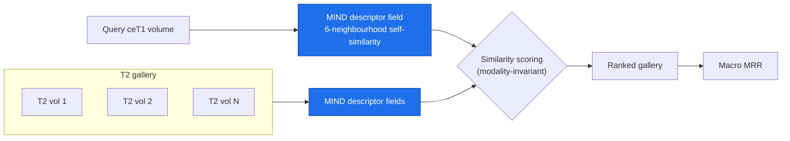
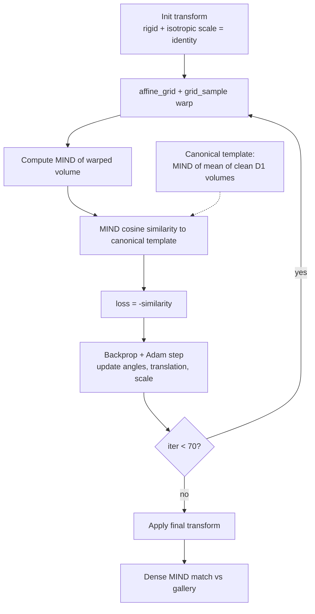

# Cross-Modal Same-Patient 3D MRI Retrieval

> Given a query contrast-enhanced T1 (ceT1) brain MRI, rank a gallery of T2 volumes so the **same individual's** T2 is at rank 1 — a fully classical, training-free solution built on the MIND descriptor.


**EHL Paris 2026 / Inria — Cross-modal content-based retrieval for 3D medical images.**

---

## Problem

Each query is a 3D contrast-enhanced **T1** brain MRI of one patient. The gallery is a set of 3D **T2**
volumes. The task is to rank the gallery so the **same patient's T2 sits at rank 1**. Scoring is the
**macro mean reciprocal rank (MRR)** — the per-dataset MRR averaged over three datasets:

```
score = (MRR_dataset1 + MRR_dataset2 + MRR_dataset3) / 3
```

The three datasets get progressively harder in geometry:

| Dataset | Geometry | Why it's hard |
|---|---|---|
| **D1** | aligned — query and gallery share a voxel grid | modality gap only |
| **D2** | D1 + independent rigid + elastic deformation per volume | modality gap **and** geometry gap |
| **D3** | pre-op → intra-op (different hospital, anatomy changed) | structural change between acquisitions |

Two things make this genuinely hard:

1. **Modality gap.** A ceT1 voxel and the corresponding T2 voxel have *different intensities* — ceT1
   enhances vessels and pathology, T2 highlights fluid — so any raw-intensity match fails.
2. **Geometry gap.** D2 breaks the shared grid and D3 changes the anatomy itself.

And crucially, **the evaluated patients are unseen** — there are only ~350 aligned labelled pairs (D1),
nowhere near enough to train a global 3D network that generalizes to new individuals.

The modality and geometry gaps in one slice (D2 example, query ceT1 vs target T2 of the same patient):


---

## Key idea: MIND descriptors

The whole solution rests on the **MIND descriptor** (Modality-Independent Neighbourhood Descriptor,
Heinrich et al.) — a per-voxel feature that encodes the **self-similarity of a voxel's local
neighbourhood** (how its patch compares to its six face-neighbours) rather than its raw intensity.

Because the structural neighbourhood layout is governed by the underlying anatomy — which is shared
across modalities — while intensity is not, we get

```
MIND(ceT1) ≈ MIND(T2)    even though    I(ceT1) ≠ I(T2)
```

This invariance is what lets a **purely classical, training-free** pipeline bridge the ceT1↔T2 gap and
beat a learned baseline. MIND is the shared backbone for every dataset.

---

## Method

A single matcher is not optimal across three different geometries, so each query is **routed** to a
dataset-specific matcher (`make_submission_best.py`), all sharing the MIND backbone (`rankers.py`):

- **D1 — aligned.** Query and gallery share a grid, so the MIND fields are correlated **densely**
  (voxel-by-voxel, no global pooling). Spatial correspondence is the strongest signal; background is
  kept deliberately because its all-ones MIND encodes the brain-mask shape, an extra alignment cue.
- **D2 — deformed.** The shared grid is broken, so each volume is first **registered back to a canonical
  pose** by GPU optimisation of a rigid + isotropic-scale transform (MIND similarity as the loss, ~70
  Adam iterations), after which the D1 dense-MIND matcher applies again.
- **D3 — pre-op → intra-op.** Anatomy changes, so an original-array **shape prior** carries the ranking,
  with a **global-MIND tiebreak** (`D3_MIND_W = 0.3`).

### System overview



### D2 canonical-pose registration loop (the centrepiece)

D2 is just D1 with each volume independently displaced, so the fix is to **undo the displacement** and
reuse the strong aligned matcher. A canonical MIND template is built once (MIND of the mean of clean D1
volumes). Each query and gallery volume is registered to it by gradient-based optimisation of a
rigid + scale transform; because the loss is on MIND, the optimisation is cross-modal and collapse-free.



This single change was the **largest lever** in the whole solution: on the D2 proxy it took the score
from **0.15 → 0.72 (4.7×)** and lifted the macro MRR from 0.61 to 0.70.

The full set of validated diagrams — system, per-dataset routing, the D2 loop, the MIND concept, and
results — lives in [`docs/ARCHITECTURE.md`](docs/ARCHITECTURE.md).

---

## Results

Real Kaggle macro MRR, per dataset and overall, against the prior baseline:

| Dataset | Setting | Method | MRR |
|---|---|---|---|
| **D1** | aligned (shared voxel grid) | dense MIND (voxel-wise) | **0.72** |
| **D2** | rigid + elastic deformation | register-to-canonical → dense MIND | **~0.60** |
| **D3** | pre-op → intra-op | shape prior + global-MIND tiebreak | **0.85** |
| **Macro** | — | per-dataset routing | **0.703** |
| Baseline | — | prior reference | 0.455 |

The routed solution reaches **0.703 macro MRR, up from 0.455 (+55%)**.

**The journey:** `0.455` (baseline) → `0.61` (dense MIND on D1, shape prior on D3) → **`0.703`** (D2
canonical-pose registration). D2, the dataset with the most headroom, was unlocked almost entirely by
the registration loop above.

---

## What we tried and ruled out

Two promising directions were investigated and **rejected with evidence** (kept for rigor, code under
[`experiments/`](experiments/)):

- **BraTS identity leak.** D1/D2 are in *BraTS format*, so we tested whether the patients are simply
  present in public BraTS cohorts. Probed against **1,251 BraTS-2021/2023 patients** — the queried
  individuals are **not** there. The leak is dead. (`experiments/brats_lookup.py`,
  `experiments/diag_lookup.py`, `experiments/leak_probe.py`.)
- **Learned contrastive 3D CNN.** A contrastive global 3D embedder scored only **0.17 macro** on the
  proxy — worse than the classical content match. With only ~350 labelled pairs there is far too little
  signal for a global 3D network to generalize to unseen patients.
  (`experiments/learned_embedder.py`, `experiments/mind_embedder.py`,
  `experiments/make_submission_learned.py`.)

---

## Reproduce

On a GPU box, with the Kaggle data at `$DATA_ROOT` (`dataset1/2/3` + the `*_queries` / `*_gallery`
CSVs):

```bash
DATA_ROOT=/path/to/data OUT=submission_best.csv python make_submission_best.py
# -> 377-row submission_best.csv, submit to Kaggle
```

Knobs (environment variables):

| Var | Default | Effect |
|---|---|---|
| `D3_MIND_W` | `0.3` | weight of the global-MIND tiebreak on D3 |
| `REG_ITERS` | `70` | D2 canonical-pose registration steps |
| `N_TMPL` | `40` | number of clean D1 volumes averaged into the canonical template |

See [`SOLUTION.md`](SOLUTION.md) for the authoritative solution summary and file map.

---

## Repo structure

```
.
├── make_submission_best.py      # generates the 0.703 submission (D1 dense / D2 registered / D3 shape+mind)
├── rankers.py                   # GPU matchers: dense MIND, register_affine, registered MIND, global MIND/NMI
├── eval_harness.py              # NIfTI loading, image index, D1/D2/D3 proxy simulators, MRR scoring
├── make_submission.py           # rank_shape — the D3 shape prior
├── make_submission_content.py   # content-match submission variant
├── make_submission_positional.py# positional/shape-only submission variant
├── split_submission.py          # split a submission into per-dataset files (displayed score ×3 = that MRR)
├── kaggle_baseline.py           # the provided baseline (reference, 0.455)
│
├── docs/
│   ├── ARCHITECTURE.md          # 5 validated mermaid diagrams (system, routing, D2 loop, MIND, results)
│   ├── YACINE_ANALYSIS.md       # analysis of the team's 0.789 improvements
│   └── progress-log.md          # chronological reasoning log
│
├── experiments/                 # exploratory + ruled-out dead ends (BraTS leak, learned model, sweeps)
├── tools/                       # jupyter_fs.py / jupyter_put.py — JupyterLab transfer helpers
│
├── SOLUTION.md                  # authoritative solution summary + reproduce command
├── PRESENTATION_SCRIPT.md       # pitch script
└── EHL_Paris_Cross-Modal_Retrieval_Pitch.pptx  # pitch deck
```

The importable core (`rankers`, `eval_harness`, `make_submission`, and the `make_submission_*` drivers)
stays at the repo root so cross-imports remain valid; only standalone exploratory scripts and the
ruled-out learned/lookup dead ends were grouped under `experiments/`.

---

## Presentation

- **Pitch deck:** [`EHL_Paris_Cross-Modal_Retrieval_Pitch.pptx`](EHL_Paris_Cross-Modal_Retrieval_Pitch.pptx)
- **Speaker script:** [`PRESENTATION_SCRIPT.md`](PRESENTATION_SCRIPT.md)

---

## Further work & team

The wider team later reached **0.789 macro MRR** (teammate Yacine) by strengthening the D2 registration
and D3 stages. The breakdown of those improvements is in
[`docs/YACINE_ANALYSIS.md`](docs/YACINE_ANALYSIS.md). Other open directions:

- **D2** — more registration iterations / multi-start / a deformable stage to undo the elastic part.
- **D3** — registration for the half the shape prior doesn't pin.
- **Dataset hunt** — if D1/D2 turn out to be a public BraTS-format cohort, identity recovery becomes the
  big lever (see `SOLUTION.md` and `docs/progress-log.md`).

---

*Official challenge repo: <https://github.com/NicoStellwag/ehl-paris-2026-medical-retrieval>*
