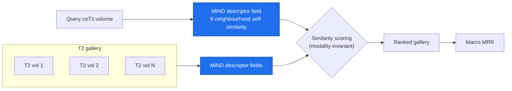
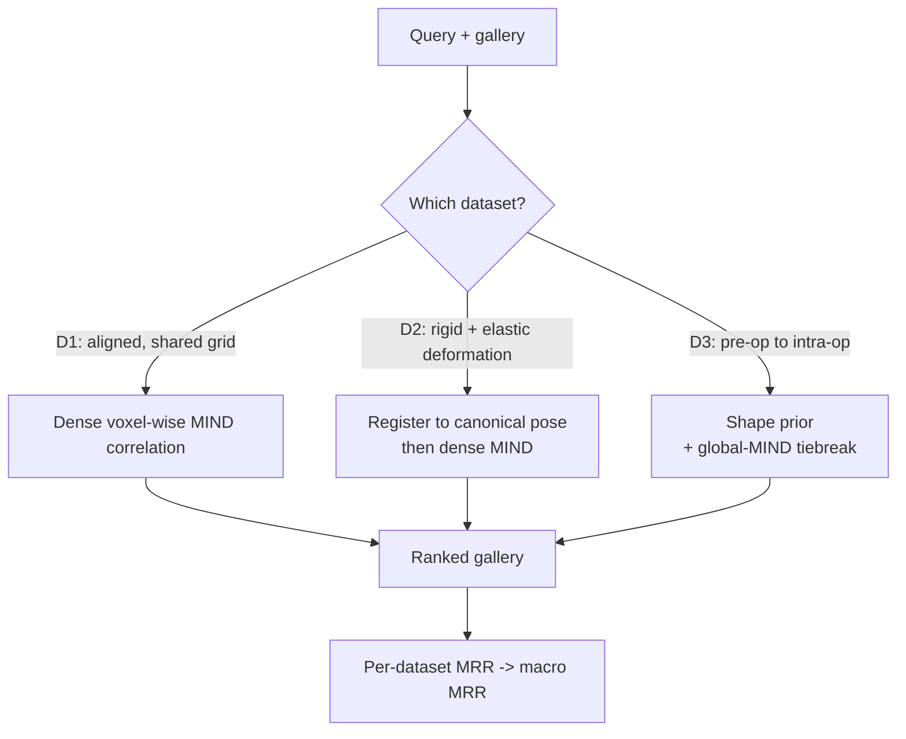
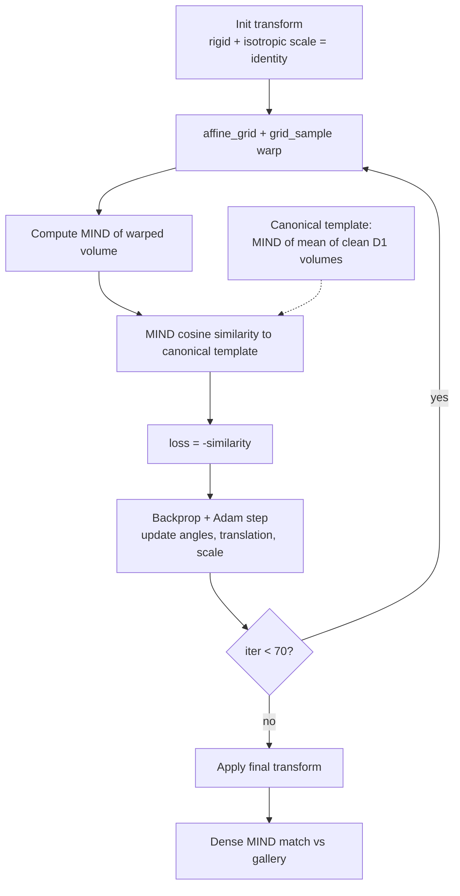
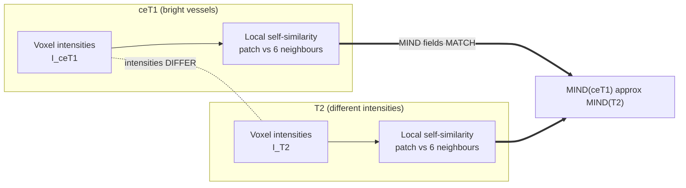
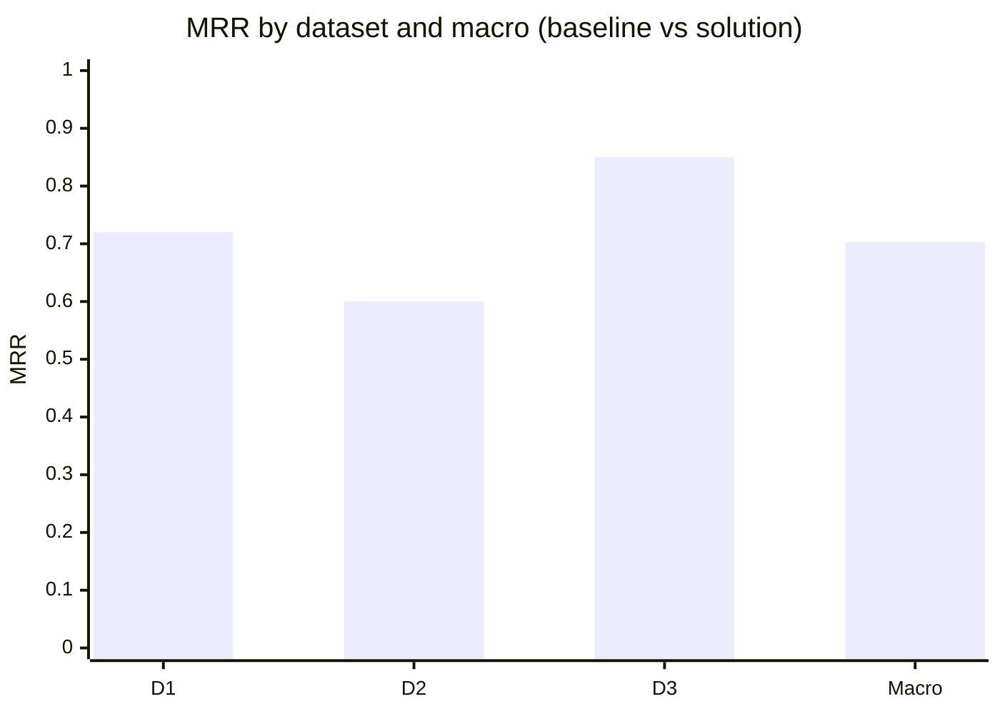

# Architecture — Cross-modal same-patient 3D MRI retrieval

EHL Paris 2026 / Inria challenge. Given a query contrast-enhanced T1 (ceT1) brain MRI volume,
rank a gallery of T2 volumes so that the **same individual's** T2 is at rank 1. Performance is
the macro mean reciprocal rank (MRR) averaged over three datasets with progressively harder
geometry. The system is **fully classical** — no learned weights — and is built around a single
modality-invariant primitive, the **MIND descriptor** (Modality-Independent Neighbourhood
Descriptor, Heinrich et al.).

---

## 1. System overview — retrieval framing

A query ceT1 volume and every gallery T2 volume are mapped to a **MIND descriptor field**: a
per-voxel feature that encodes the self-similarity of a voxel's local neighbourhood (texture)
rather than its raw intensity. Because the structural neighbourhood layout is shared across
modalities while intensity is not, MIND bridges the ceT1↔T2 gap without any training. Similarity
between the query field and each gallery field produces a score vector; sorting it yields the
ranked gallery, and the rank of the true match feeds the MRR. MIND is the shared backbone for
every dataset.

The MIND field (`_mind` in `rankers.py`) is the Heinrich 6-neighbourhood form: for each voxel,
the patch sum-of-squared-differences to its six face-neighbours is computed, normalised by the
local variance, exponentiated, and channel-normalised. The 12-pair MIND-SSC variant scored higher
on dataset 1 in isolation but regressed the registered-d2 / d3 pipeline overall, so the 6-neighbour
form is retained.

---

## 2. Per-dataset routing

The three datasets differ only in geometry, so a single matcher is not optimal everywhere. Each
query is dispatched to a dataset-specific matcher (`make_submission_best.py`):

- **D1 — aligned (shared voxel grid).** Query and gallery already occupy a common grid, so the
  MIND fields are correlated **densely** (voxel-by-voxel, no global pooling). Keeping spatial
  correspondence is the strongest signal here; background is deliberately kept because its all-ones
  MIND encodes the brain-mask shape, an additional alignment cue.
- **D2 — D1 plus independent rigid + elastic deformation.** The common grid is broken, so each
  volume is first **registered back to a canonical pose** (see §3), after which the D1 dense-MIND
  matcher applies again.
- **D3 — pre-op → intra-op (structurally different).** Anatomy changes between acquisitions, so an
  original-array **shape prior** carries the ranking, with a **global-MIND tiebreak**
  (`D3_MIND_W = 0.3`).

---

## 3. D2 canonical-pose registration loop (centrepiece)

D2 is just D1 with each volume independently displaced, so the fix is to **undo the displacement**
and reuse the strong aligned matcher. A canonical MIND template is built once as the MIND of the
mean of clean dataset-1 volumes (a fuzzy average pose). Each query and gallery volume is then
registered to that template by **gradient-based optimisation of a rigid + isotropic-scale
transform**, using MIND cosine similarity as the loss. The transform parameters (Euler angles,
translation, log-scale) start at identity and are updated by Adam for ~70 iterations
(`REG_ITERS = 70`); because the loss is on MIND, the optimisation is cross-modal and collapse-free.
The warped volumes then go straight into the dense-MIND matcher.

This single change was the largest lever in the whole solution: on the D2 proxy it took the score
from **0.15 → 0.72 (4.7×)** and lifted the macro MRR from 0.61 to 0.70. Implementation:
`register_affine` and `rank_dense_mind_registered` in `rankers.py`; template construction in
`build_template_mind`.

---

## 4. The MIND descriptor concept

The reason MIND works cross-modally: a ceT1 voxel and the corresponding T2 voxel have **different
intensities** (ceT1 enhances vessels and pathology, T2 highlights fluid), so any intensity-based
match fails. But the **local self-similarity** — how a voxel's patch compares to its six
face-neighbours — is governed by the underlying anatomy, which is shared. Hence
MIND(ceT1) ≈ MIND(T2) even though I(ceT1) ≠ I(T2).

This invariance is what lets a purely classical pipeline beat a learned baseline: a contrastive
3D CNN scored only 0.17 macro on the proxy (too few labelled pairs — 350 — for a global 3D
network), and a BraTS identity-leak shortcut was tested against 1,251 patients and ruled out.

---

## 5. Results

Real Kaggle macro MRR, per dataset and overall, against the prior baseline:

| Dataset | Setting | Method | MRR |
|---|---|---|---|
| D1 | aligned (shared voxel grid) | dense MIND (voxel-wise) | 0.72 |
| D2 | rigid + elastic deformation | register-to-canonical → dense MIND | ~0.60 |
| D3 | pre-op → intra-op | shape prior + global-MIND tiebreak | 0.85 |
| **Macro** | — | per-dataset routing | **0.703** |
| Baseline | — | prior reference | 0.455 |

The routed solution reaches **0.703 macro MRR, up from 0.455 (+55%)**. D2, the dataset with the
most headroom, was unlocked almost entirely by the registration loop in §3.

---

### Source map

| Component | File |
|---|---|
| Per-dataset routing, 0.703 submission | `make_submission_best.py` |
| MIND field, dense/global/registered matchers | `rankers.py` |
| Canonical-pose registration | `register_affine`, `rank_dense_mind_registered` (`rankers.py`) |
| Template construction | `build_template_mind` (`rankers.py`) |
| D3 shape prior | `rank_shape` (`make_submission.py`) |
| NIfTI loading, proxy simulators, MRR scoring | `eval_harness.py` |
